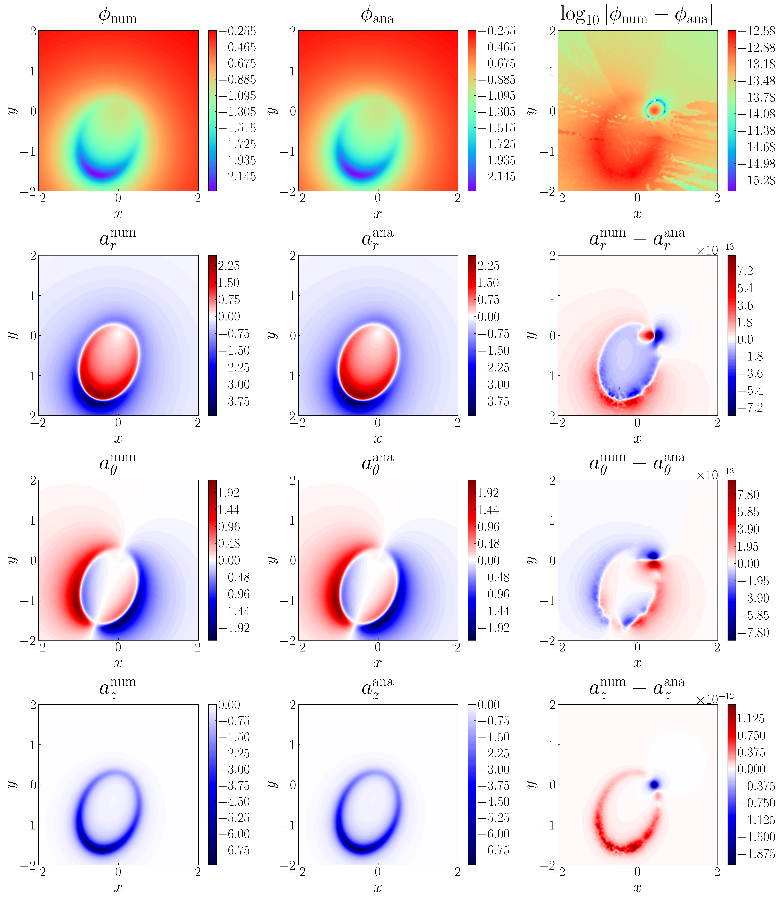

# Gravitational Potentials of Circular and Eccentric Rings and Arcs

Closed-form expressions for the gravitational potentials and/or accelerations of circular arcs, uniform eccentric rings, and Keplerian rings/arcs.  
Derived using elliptic integrals for both analytic insight and fast computation.

---

## Example Notebooks

| Notebook | Description |
|-----------|--------------|
| `Circular_Arc.ipynb` | Circular arc potentials and accelerations |
| `Circular_Ring.ipynb` | Classic circular ring validation |
| `Eccentric_Uniform_Arc.ipynb` | Uniform eccentric arc potential |
| `Eccentric_Uniform_Ring.ipynb` | Uniform eccentric ring potential |
| `Planetary_Ring_Accels.ipynb` | Acceleration components for circular and Keplerian rings |
| `Planetary_Ring_Averaging.ipynb` | Averaged Keplerian ring potentials |
| `Elliptic_Continuation_Paper_Plot.ipynb` | Reproduces main paper plots |

**KeplerProp** is a lightweight toolkit for propagating and sampling Keplerian orbits.  
It computes positions and velocities from orbital elements, but uses interpolation to increase speed. 

